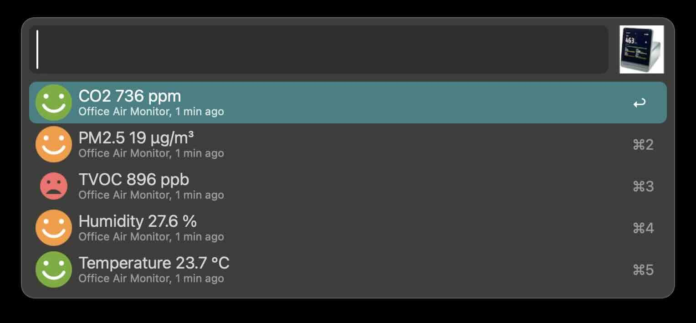

# alfred-qingping-monitor

## Feature

Make your Qingping air monitoring data available in Alfred 5.
For now, it only supports cloud data.
It now supports displaying the following data: CO2, PM2.5, TVOC, Temperature, Humidity.

## Prerequisite

- Alfred 5
- Python 3
- Qingping air monitor (for example, [Qingping Air Monitor](https://www.qingping.co/air-monitor/overview))

## Configuration

Connect the Qingping Air monitor to the Qingping+ app.
Generate a Qingping Developer API token from [developer.qingping.co/personal/permissionApply | Access Management | Apply Access](https://developer.qingping.co/personal/permissionApply)
